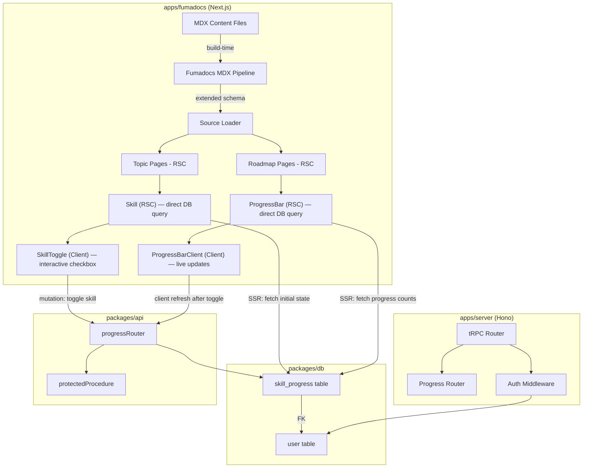

# Design Document: Interactive Learning Roadmaps

## Overview

This design transforms the existing Fumadocs documentation site (`apps/fumadocs`) into an interactive learning platform. The core idea: MDX content files gain structured frontmatter and embedded `<Skill>` components that define a hierarchy of Roadmaps → Tracks → Topics → Skills. Authenticated students toggle skill completion via optimistic UI, with progress persisted to PostgreSQL through the existing tRPC/Hono backend.

The system leverages Fumadocs' built-in React Server Component (RSC) support in MDX content to adopt a hybrid RSC approach:

1. **Content Layer** — Fumadocs MDX pipeline extended with custom frontmatter schema and a `<Skill>` RSC component. Since Fumadocs supports RSC in MDX, the `<Skill>` component is a server component that queries the database directly at render time to fetch the authenticated user's completion state. A nested client component handles the interactive checkbox toggle. Build-time validation ensures structural integrity.
2. **API Layer** — New tRPC router in `packages/api` exposing progress mutation and query endpoints behind `protectedProcedure`. Initial page loads no longer require a separate tRPC call to fetch progress — that data is rendered server-side. tRPC endpoints remain necessary for mutations (`toggleSkill`) and client-side refresh after toggles.
3. **Data Layer** — New Drizzle ORM schema in `packages/db` for `skill_progress` records, with foreign key to the existing `user` table.

The teacher CMS (rich text editor, PR workflow, live preview) is explicitly out of scope — teachers author MDX files directly for this spec.

## Architecture



### Key Design Decisions

1. **Content-driven structure over database-driven**: Roadmap/Track/Topic hierarchy lives in MDX frontmatter, not in database tables. This keeps content authoring simple (just MDX files) and avoids syncing content metadata to the DB. The DB only stores progress records.

2. **Build-time validation**: Skill ID uniqueness and frontmatter correctness are validated at build time via the Fumadocs MDX pipeline (custom Zod schema in `source.config.ts`). This catches errors early rather than at runtime.

3. **Optimistic UI with server reconciliation**: Skill toggles update the UI immediately via the client component and fire a tRPC mutation in the background. On failure, the UI reverts and shows an error toast.

4. **Single progress table**: Rather than separate tables for roadmap/track/topic progress, we store only skill-level completion. Topic/Track/Roadmap progress is computed by aggregating skill records against the content structure. This avoids data duplication and keeps the schema minimal.

5. **Hybrid RSC approach**: Fumadocs supports React Server Components in MDX content, allowing `import { db } from "@/lib/db"` and direct database queries inside components. The `<Skill>` and `<ProgressBar>` components are server components that fetch the authenticated user's progress at render time (SSR). Interactive behavior (checkbox toggle) is delegated to a nested client component. This eliminates the need for a separate tRPC call on initial page load — progress state is already baked into the server-rendered HTML. tRPC endpoints remain for mutations and client-side state refresh after toggles.

## Components and Interfaces

### Content Components (apps/fumadocs)

#### `<Skill>` MDX Component (React Server Component)

The `<Skill>` component uses Fumadocs' RSC-in-MDX support. It is an `async` server component that queries the database directly at render time to determine the authenticated user's completion state for this skill.

```tsx
// Server Component — runs at SSR time inside MDX content
import { db } from "@masterdocs/db";
import { skillProgress } from "@masterdocs/db/schema";
import { auth } from "@masterdocs/auth";
import { eq, and } from "drizzle-orm";
import { headers } from "next/headers";
import { SkillToggle } from "./skill-toggle.client";

interface SkillProps {
  id: string;    // Unique skill identifier (e.g., "js-variables")
  label: string; // Human-readable label (e.g., "Understand JavaScript variables")
}

export async function Skill({ id, label }: SkillProps) {
  const session = await auth.api.getSession({ headers: await headers() });

  let completed = false;
  if (session?.user) {
    const record = await db.query.skillProgress.findFirst({
      where: and(
        eq(skillProgress.userId, session.user.id),
        eq(skillProgress.skillId, id),
      ),
    });
    completed = !!record;
  }

  return (
    <SkillToggle
      id={id}
      label={label}
      initialCompleted={completed}
      isAuthenticated={!!session?.user}
    />
  );
}
```

#### `<SkillToggle>` Client Component

Handles the interactive checkbox toggle with optimistic UI and tRPC mutation.

```tsx
// Client Component — handles interactivity
"use client";

interface SkillToggleProps {
  id: string;
  label: string;
  initialCompleted: boolean;
  isAuthenticated: boolean;
}

export function SkillToggle({ id, label, initialCompleted, isAuthenticated }: SkillToggleProps) {
  // Uses React state initialized from server-provided `initialCompleted`
  // On toggle: optimistic UI update → tRPC mutation → revert on failure
  // When !isAuthenticated: disabled checkbox with sign-in prompt on interaction
}
```

This pattern means the initial page load renders the correct completion state without any client-side API call. The `SkillToggle` client component only calls tRPC for mutations (toggle) and uses `initialCompleted` from the server as its starting state.

#### `<ProgressBar>` Component (React Server Component)

Like `<Skill>`, the `<ProgressBar>` leverages RSC to fetch progress data server-side at render time. On Roadmap/Track pages, it queries the database directly for the authenticated user's completed skill counts.

```tsx
// Server Component — fetches progress at SSR time
import { db } from "@masterdocs/db";
import { skillProgress } from "@masterdocs/db/schema";
import { auth } from "@masterdocs/auth";
import { eq, and, inArray } from "drizzle-orm";
import { headers } from "next/headers";
import { ProgressBarClient } from "./progress-bar.client";

interface ProgressBarProps {
  skillIds: string[];  // All skill IDs in the scope (topic/track/roadmap)
  label?: string;
}

export async function ProgressBar({ skillIds, label }: ProgressBarProps) {
  const session = await auth.api.getSession({ headers: await headers() });

  let completed = 0;
  if (session?.user && skillIds.length > 0) {
    const records = await db.query.skillProgress.findMany({
      where: and(
        eq(skillProgress.userId, session.user.id),
        inArray(skillProgress.skillId, skillIds),
      ),
    });
    completed = records.length;
  }

  return (
    <ProgressBarClient
      completed={completed}
      total={skillIds.length}
      label={label}
      isAuthenticated={!!session?.user}
    />
  );
}
```

#### `<ProgressBarClient>` Client Component

```tsx
"use client";

interface ProgressBarClientProps {
  completed: number;
  total: number;
  label?: string;
  isAuthenticated: boolean;
}

export function ProgressBarClient({ completed, total, label, isAuthenticated }: ProgressBarClientProps) {
  // Renders horizontal bar with percentage
  // When !isAuthenticated: shows 0% with "Sign in to track progress" label
  // After a skill toggle on the same page, can refresh via tRPC or router.refresh()
}
```

The server component provides the initial progress counts at render time. After a skill toggle, the client component can either call `router.refresh()` to re-render the server component with fresh data, or use a tRPC query for a lighter client-side update.

#### `<RoadmapView>` Page Component
Displays all tracks within a roadmap, each with its topics and a track-level progress bar. Also shows an overall roadmap progress bar at the top.

#### `<RoadmapIndex>` Page Component
Lists all available roadmaps with name, description, and a link to each roadmap view.

### Auth Integration (apps/fumadocs)

Authentication uses better-auth's **email OTP plugin** — no passwords anywhere in the system. The flow:

1. Student enters their email on the sign-in page.
2. better-auth sends a one-time password to that email via the configured email provider.
3. Student enters the OTP to complete sign-in.
4. If no account exists for that email, better-auth automatically creates one (no separate registration step). The new account's `username` (or `name`) field is set to the email address by default.
5. Students can update their username later via a profile page.

The `apps/fumadocs` auth client layer calls the existing better-auth endpoints on `apps/server`. Provides:
- `useSession()` hook for checking auth state in client components
- OTP sign-in UI (email input → OTP input) integrated into the Fumadocs layout header
- Sign-out UI in the header
- Profile page (`/profile`) for updating username

### API Interfaces (packages/api)

#### Progress Router (`progressRouter`)

```typescript
// Toggle a skill's completion status (primary mutation endpoint)
progress.toggleSkill
  Input:  { skillId: string, completed: boolean }
  Output: { success: boolean }

// Get all progress records for a student within a roadmap
// NOTE: With the RSC hybrid approach, initial page loads fetch progress
// server-side via direct DB queries. This endpoint is retained for
// client-side refresh scenarios (e.g., after a skill toggle, the client
// can re-fetch to sync state without a full page reload).
progress.getByRoadmap
  Input:  { roadmapSlug: string }
  Output: { records: Array<{ skillId: string, completedAt: Date }> }

// Get progress summary (completed counts per track)
// Similarly, Roadmap/Track pages fetch initial summary data server-side.
// This endpoint supports client-side refresh after mutations.
progress.getSummary
  Input:  { roadmapSlug: string }
  Output: { tracks: Array<{ trackSlug: string, completed: number, total: number }>, overall: { completed: number, total: number } }
```

All endpoints use `protectedProcedure` — the user ID comes from the session context, never from client input.

**Data flow summary:**
- **Initial page load (SSR)**: `<Skill>` and `<ProgressBar>` RSC components query the DB directly via Drizzle ORM. No tRPC call needed.
- **Skill toggle (client interaction)**: `<SkillToggle>` client component calls `progress.toggleSkill` via tRPC. On success, either calls `router.refresh()` to re-render RSC components with fresh data, or calls `progress.getByRoadmap` / `progress.getSummary` for a lighter client-side state update.
- **Error recovery**: On mutation failure, optimistic UI reverts and an error toast is shown.

### Content Source Extension (source.config.ts)

The existing `pageSchema` is extended with an optional `roadmap` frontmatter field:

```typescript
const roadmapFrontmatter = z.object({
  roadmap: z.string(),       // Roadmap slug (e.g., "frontend-development")
  track: z.string(),         // Track slug (e.g., "javascript-fundamentals")
  trackTitle: z.string(),    // Track display name
  trackOrder: z.number(),    // Track sort order within roadmap
  topicOrder: z.number(),    // Topic sort order within track
}).optional();
```

A separate `roadmaps` content collection (or a `_roadmaps` metadata directory) defines roadmap-level metadata:

```yaml
# content/roadmaps/frontend-development.mdx (frontmatter only)
---
title: Frontend Development
description: A complete path from HTML basics to modern frameworks.
---
```

## Data Models

### skill_progress Table (packages/db)

```sql
CREATE TABLE skill_progress (
  id          TEXT PRIMARY KEY,          -- nanoid or cuid
  user_id     TEXT NOT NULL REFERENCES "user"(id) ON DELETE CASCADE,
  skill_id    TEXT NOT NULL,             -- matches <Skill id="..."> in MDX
  completed_at TIMESTAMP NOT NULL DEFAULT NOW(),
  UNIQUE(user_id, skill_id)
);

CREATE INDEX skill_progress_user_id_idx ON skill_progress(user_id);
CREATE INDEX skill_progress_skill_id_idx ON skill_progress(skill_id);
```

Drizzle ORM schema:

```typescript
import { pgTable, text, timestamp, unique, index } from "drizzle-orm/pg-core";
import { user } from "./auth";

export const skillProgress = pgTable(
  "skill_progress",
  {
    id: text("id").primaryKey(),
    userId: text("user_id")
      .notNull()
      .references(() => user.id, { onDelete: "cascade" }),
    skillId: text("skill_id").notNull(),
    completedAt: timestamp("completed_at").defaultNow().notNull(),
  },
  (table) => [
    unique("skill_progress_user_skill_unique").on(table.userId, table.skillId),
    index("skill_progress_user_id_idx").on(table.userId),
    index("skill_progress_skill_id_idx").on(table.skillId),
  ],
);
```

### Content Model (MDX Frontmatter — not in DB)

Topic MDX files include roadmap metadata in frontmatter:

```yaml
---
title: Variables and Data Types
description: Learn about JavaScript variables, constants, and primitive types.
roadmap: frontend-development
track: javascript-fundamentals
trackTitle: JavaScript Fundamentals
trackOrder: 1
topicOrder: 1
---

Content here...

<Skill id="js-var-declaration" label="Declare variables with let, const, and var" />
<Skill id="js-data-types" label="Identify primitive data types" />
```

Roadmap metadata files define top-level roadmap info:

```yaml
---
title: Frontend Development
description: A complete path from HTML basics to modern frameworks.
---
```

### Derived Data Structures (computed at request time)

```typescript
// Built from content source at build/request time
interface RoadmapStructure {
  slug: string;
  title: string;
  description: string;
  tracks: TrackStructure[];
}

interface TrackStructure {
  slug: string;
  title: string;
  order: number;
  topics: TopicStructure[];
}

interface TopicStructure {
  slug: string;
  title: string;
  order: number;
  skillIds: string[];
  url: string;
}
```

These structures are derived from the Fumadocs source loader by filtering and grouping pages that have `roadmap` frontmatter. The `getSummary` API endpoint uses these structures combined with the student's `skill_progress` records to compute completion counts.


## Correctness Properties

*A property is a characteristic or behavior that should hold true across all valid executions of a system — essentially, a formal statement about what the system should do. Properties serve as the bridge between human-readable specifications and machine-verifiable correctness guarantees.*

### Property 1: Frontmatter parsing round-trip

*For any* valid roadmap frontmatter object (with roadmap slug, track slug, trackTitle, trackOrder, and topicOrder), serializing it to YAML frontmatter and parsing it back through the Zod schema should produce an equivalent object with all fields preserved.

**Validates: Requirements 1.1, 1.2**

### Property 2: Track grouping and ordering

*For any* set of topics with valid roadmap frontmatter belonging to the same roadmap, the grouping function should produce tracks where: (a) every topic appears in exactly one track matching its `track` field, (b) tracks are sorted by `trackOrder`, and (c) topics within each track are sorted by `topicOrder`.

**Validates: Requirements 1.3**

### Property 3: Invalid frontmatter exclusion

*For any* mixed set of topics where some have valid roadmap frontmatter and some have invalid or missing frontmatter, the roadmap structure builder should include only topics with valid frontmatter, and the count of included topics should equal the count of valid inputs.

**Validates: Requirements 1.5**

### Property 4: Skill extraction completeness

*For any* topic containing N `<Skill>` components with distinct IDs, the skill extraction function should return exactly N skill IDs, and the set of extracted IDs should equal the set of input IDs.

**Validates: Requirements 2.2**

### Property 5: Skill ID uniqueness detection

*For any* set of topics within a roadmap where at least two `<Skill>` components share the same `id`, the uniqueness validator should report a validation error identifying the duplicate ID(s). Conversely, for any set where all IDs are unique, the validator should report no errors.

**Validates: Requirements 2.5**

### Property 6: User isolation

*For any* two distinct authenticated users A and B, and any set of skill toggle operations performed by each: (a) toggling a skill as user A creates a record with user A's ID, never user B's, and (b) querying progress as user A returns only records with user A's ID.

**Validates: Requirements 3.7, 6.3**

### Property 7: Skill toggle round-trip

*For any* authenticated user and valid skill ID, toggling the skill to complete and then toggling it to incomplete should result in no progress record existing for that user-skill pair. Conversely, toggling to complete should result in exactly one record existing.

**Validates: Requirements 4.1, 4.2**

### Property 8: Progress state mapping (SSR)

*For any* set of skill IDs in a topic and any subset of those IDs marked as completed in the user's progress records, the server-side state resolution function (as used by the `<Skill>` RSC component) should produce a completion state for each skill that is `true` if and only if its ID is in the completed subset.

**Validates: Requirements 4.3**

### Property 9: Progress ratio computation

*For any* roadmap structure (with tracks and topics containing skill IDs) and any set of completed skill IDs for a user, the progress computation should satisfy: (a) topic progress = count of completed skills in that topic / total skills in that topic, (b) track progress = count of completed skills across all topics in that track / total skills in that track, (c) roadmap progress = count of completed skills across all tracks / total skills in the roadmap. All ratios should be in [0, 1].

**Validates: Requirements 5.1, 5.2, 5.3, 8.2**

### Property 10: Prev/next topic navigation

*For any* ordered list of topics within a track, for the topic at index i: (a) if i > 0, the previous link should point to the topic at index i-1, otherwise previous should be null, (b) if i < length-1, the next link should point to the topic at index i+1, otherwise next should be null.

**Validates: Requirements 7.4**

### Property 11: Roadmap-scoped progress filtering

*For any* authenticated user with progress records spanning multiple roadmaps, querying progress for a specific roadmap should return only records whose skill IDs belong to topics within that roadmap. No records for skills in other roadmaps should be included.

**Validates: Requirements 8.1**

## Error Handling

| Scenario | Behavior | User Feedback |
|---|---|---|
| API unreachable on skill toggle | Revert optimistic UI update | Toast notification: "Could not save progress. Please try again." |
| Invalid/missing `roadmap` frontmatter | Exclude topic from roadmap views | Build-time warning in console log |
| Missing `id` or `label` on `<Skill>` | Block build | Build-time error identifying file and location |
| Duplicate skill IDs within a roadmap | Block build | Build-time error listing duplicate IDs and files |
| Unauthenticated user toggles skill | Prevent toggle, show prompt | Inline prompt: "Sign in to track your progress" |
| Non-existent roadmap slug in API query | Return NOT_FOUND error | 404 page or error state in UI |
| Duplicate skill toggle (race condition) | Upsert semantics — ON CONFLICT DO NOTHING | No error shown; idempotent |
| Database connection failure | Return INTERNAL_SERVER_ERROR | Toast notification: "Something went wrong. Please try again." |

## Testing Strategy

### Unit Tests (Example-Based)

- **Skill RSC rendering**: Verify `<Skill>` server component queries DB and passes correct `initialCompleted` to `<SkillToggle>` client component (2.1, 2.3)
- **SkillToggle client behavior**: Verify optimistic toggle, tRPC mutation call, and revert on failure (4.4)
- **Auth state UI**: Verify `<SkillToggle>` renders disabled checkbox when `isAuthenticated=false` (3.5), sign-in prompt on interaction (3.6)
- **Username defaults to email**: Verify that on first-time OTP sign-in, the created account's username equals the email address (3.3)
- **Username update**: Verify that an authenticated user can update their username via the profile page mutation (3.4)
- **ProgressBar RSC rendering**: Verify `<ProgressBar>` server component queries DB and passes correct counts to `<ProgressBarClient>` (5.1, 5.2, 5.3)
- **Progress bar at zero**: Verify `<ProgressBarClient>` shows 0% with sign-in message when `isAuthenticated=false` (5.5)
- **Client-side refresh after toggle**: Verify that after a successful `toggleSkill` mutation, the client triggers `router.refresh()` or tRPC re-fetch to update visible progress (5.4)
- **Protected endpoint access**: Verify UNAUTHORIZED error for unauthenticated tRPC requests (6.1)
- **Roadmap index rendering**: Verify names and descriptions appear (7.1)
- **Navigation links**: Verify roadmap → roadmap view (7.2), topic link → docs page (7.3)
- **Sidebar entries**: Verify roadmap entries appear in Fumadocs sidebar (7.5)
- **NOT_FOUND validation**: Verify error response for non-existent roadmap slugs (8.4)
- **Unique constraint**: Verify duplicate (userId, skillId) insert fails (6.4)

### Property-Based Tests

Property-based tests use `fast-check` (TypeScript) with a minimum of 100 iterations per property.

Each test is tagged with: `Feature: interactive-learning-roadmaps, Property {N}: {title}`

| Property | What's Generated | What's Verified |
|---|---|---|
| 1: Frontmatter round-trip | Random valid frontmatter objects | Parse(serialize(obj)) === obj |
| 2: Track grouping/ordering | Random topic sets with track metadata | Correct grouping + sort order |
| 3: Invalid frontmatter exclusion | Mixed valid/invalid topic sets | Only valid topics in output |
| 4: Skill extraction | Topics with random skill ID sets | Extracted IDs === input IDs |
| 5: Skill ID uniqueness | Skill ID sets with/without duplicates | Validator detects iff duplicates exist |
| 6: User isolation | Multi-user progress records | Write uses session ID; read returns only own |
| 7: Toggle round-trip | Random user + skill ID pairs | Complete then incomplete → no record |
| 8: Progress state mapping (SSR) | Skill ID sets + completed subsets | SSR state resolution matches set membership |
| 9: Progress ratio computation | Roadmap structures + completed sets | Ratios correct at all levels |
| 10: Prev/next navigation | Ordered topic lists + random index | Correct adjacent topic links |
| 11: Roadmap-scoped filtering | Multi-roadmap progress records | Query returns only matching roadmap's skills |

### Integration Tests

- **RSC data loading**: Render a topic page with `<Skill>` components for an authenticated user → verify the server-rendered HTML contains the correct completion states from the DB without any client-side fetch
- **Auth flow**: Sign in via email OTP → verify account created on first sign-in → toggle skill via `<SkillToggle>` → verify progress persisted → sign out → verify disabled state (3.1, 3.2)
- **No password endpoints**: Verify that no password-based sign-in or registration endpoints are exposed (3.1)
- **Cascade delete**: Create user → add progress → delete user → verify progress removed (6.5)
- **End-to-end progress**: Complete skills across topics → verify track/roadmap progress bars update (via `router.refresh()` or tRPC re-fetch)
- **SSR + client hydration**: Verify that `<SkillToggle>` hydrates correctly with server-provided `initialCompleted` and subsequent toggles work without full page reload
- **Performance**: Toggle endpoint responds within 500ms (4.5); summary endpoint within 300ms for 500 skills (8.3); SSR DB queries for `<Skill>` and `<ProgressBar>` complete within acceptable render time
