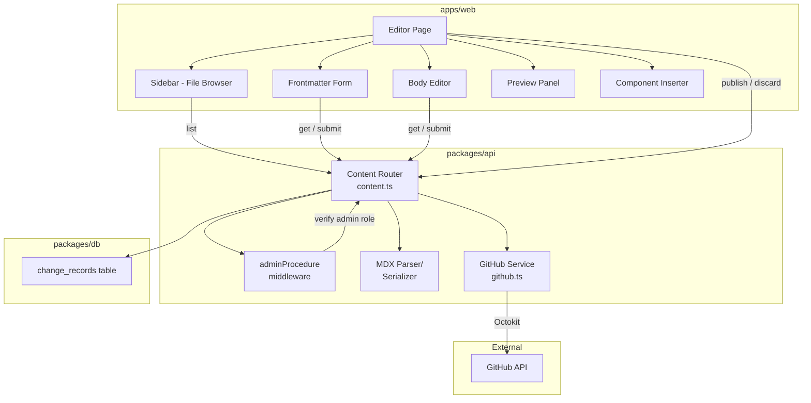
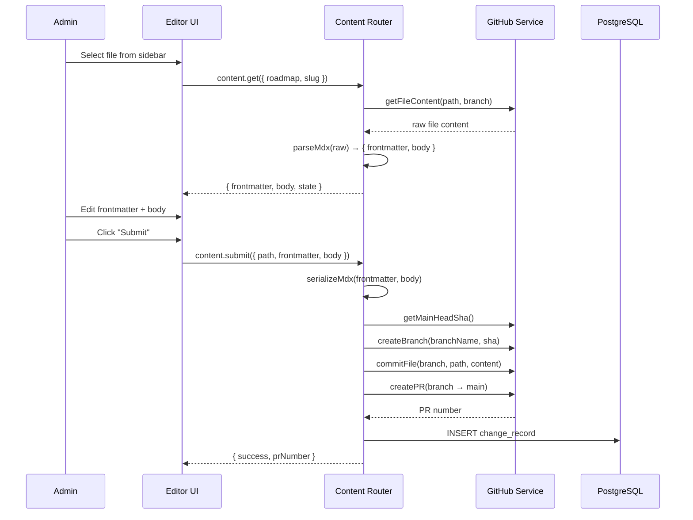

# Design Document: MDX Content Editor

## Overview

The MDX Content Editor adds a GitHub-backed content management interface to the web app (`apps/web`). Administrators can browse, create, edit, and publish MDX documentation files that power the fumadocs learning platform — without touching Git directly.

The system is split into three layers:

1. **GitHub Service** (`packages/api/src/lib/github.ts`) — a thin Octokit wrapper handling all repository operations (read trees, read/write files, branches, commits, PRs, merges).
2. **Content tRPC Router** (`packages/api/src/routers/content.ts`) — server-side business logic: MDX parsing/serialization, authorization, change tracking, conflict detection.
3. **Editor UI** (`apps/web/src/routes/admin/content/`) — React pages for browsing, editing, previewing, and publishing content.

Content flows through Git but the user never sees it. They work with three content states — **draft** (unsaved local edits), **pending_review** (branch + PR created), and **published** (merged to main).

## Architecture



### Request Flow: Editing and Submitting



## Components and Interfaces

### GitHub Service (`packages/api/src/lib/github.ts`)

A stateless module wrapping Octokit. All methods accept explicit owner/repo/token or read from server env.

```typescript
interface GitHubService {
  // Tree operations
  getDirectoryTree(path: string, branch?: string): Promise<TreeEntry[]>;
  getFileContent(path: string, branch?: string): Promise<{ content: string; sha: string }>;

  // Branch operations
  getMainHeadSha(): Promise<string>;
  createBranch(name: string, sha: string): Promise<void>;
  deleteBranch(name: string): Promise<void>;

  // Commit operations
  createOrUpdateFile(params: {
    path: string;
    content: string;
    message: string;
    branch: string;
    sha?: string; // required for updates, omit for creates
  }): Promise<{ sha: string }>;

  // PR operations
  createPullRequest(params: {
    title: string;
    body: string;
    head: string;
    base: string;
  }): Promise<{ number: number }>;
  mergePullRequest(prNumber: number, mergeMethod: "merge"): Promise<void>;
  closePullRequest(prNumber: number): Promise<void>;

  // Conflict detection
  getCommitSha(branch: string): Promise<string>;
  compareCommits(base: string, head: string): Promise<{ files: ChangedFile[] }>;
}
```

### MDX Parser/Serializer (`packages/api/src/lib/mdx.ts`)

Pure functions for MDX round-tripping. No AST parsing — simple string splitting on `---` delimiters.

```typescript
interface MdxFrontmatter {
  title: string;
  description?: string;
  roadmap?: string;
  track?: string;
  trackTitle?: string;
  trackOrder?: number;
  topicOrder?: number;
}

function parseMdx(raw: string): { frontmatter: MdxFrontmatter; body: string };
function serializeMdx(frontmatter: MdxFrontmatter, body: string): string;
```

Parsing: split on first two `---` lines, YAML-parse the middle, remainder is body.
Serialization: YAML-stringify frontmatter between `---` delimiters, blank line, then body.

### Content tRPC Router (`packages/api/src/routers/content.ts`)

All procedures use `adminProcedure` (extends `protectedProcedure` with role check).

```typescript
// New middleware
const adminProcedure = protectedProcedure.use(({ ctx, next }) => {
  if (ctx.session.user.role !== "admin") {
    throw new TRPCError({ code: "FORBIDDEN", message: "Admin access required" });
  }
  return next({ ctx });
});

// Router procedures
contentRouter = router({
  list:          adminProcedure.query(...)           // → ContentListItem[]
  get:           adminProcedure.input(...).query(...) // → { frontmatter, body, state, changeRecord? }
  submit:        adminProcedure.input(...).mutation(...)  // → { prNumber, branchName }
  create:        adminProcedure.input(...).mutation(...)  // → { prNumber, branchName }
  publish:       adminProcedure.input(...).mutation(...)  // → { success }
  discard:       adminProcedure.input(...).mutation(...)  // → { success }
  checkConflict: adminProcedure.input(...).query(...)     // → { hasConflict, mainSha }
  resolveConflict: adminProcedure.input(...).mutation(...) // → { success }
});
```

### Editor UI Components (`apps/web`)

| Component | Location | Responsibility |
|---|---|---|
| `ContentLayout` | `routes/admin/content/route.tsx` | Layout with sidebar + main area |
| `ContentSidebar` | `components/content/sidebar.tsx` | Collapsible roadmap tree, pending indicators |
| `ContentEditor` | `routes/admin/content/$roadmap.$slug.tsx` | Orchestrates frontmatter form + body editor + preview |
| `FrontmatterForm` | `components/content/frontmatter-form.tsx` | Structured form fields with validation |
| `BodyEditor` | `components/content/body-editor.tsx` | CodeMirror with Markdown mode + toolbar |
| `PreviewPanel` | `components/content/preview-panel.tsx` | react-markdown rendered preview |
| `ComponentInserter` | `components/content/component-inserter.tsx` | Dialogs for Skill/YouTube insertion |
| `ConflictResolver` | `components/content/conflict-resolver.tsx` | Side-by-side diff + resolution actions |
| `PendingChanges` | `routes/admin/content/pending.tsx` | List of all pending Change_Records |
| `NewFileDialog` | `components/content/new-file-dialog.tsx` | Roadmap directory + slug input |

### Key Library Choices

- **CodeMirror 6** (`@codemirror/view`, `@codemirror/lang-markdown`) — body editor with Markdown syntax highlighting. Mature, extensible, works well with React 19.
- **react-markdown** + **remark-gfm** — preview rendering. Lightweight, supports custom component mapping for `<Skill>` and `<YouTube>` placeholders.
- **Octokit** (`@octokit/rest`) — GitHub API client. Official, well-typed, handles auth and rate limiting.
- **yaml** (`yaml` package) — YAML parsing/serialization for frontmatter. Preserves key ordering and formatting better than `js-yaml`.


## Data Models

### Database: `change_records` Table

New Drizzle schema in `packages/db/src/schema/change-records.ts`:

```typescript
import { pgTable, text, timestamp, integer, index } from "drizzle-orm/pg-core";
import { user } from "./auth";

export const changeRecords = pgTable(
  "change_records",
  {
    id: text("id")
      .primaryKey()
      .$defaultFn(() => crypto.randomUUID()),
    userId: text("user_id")
      .notNull()
      .references(() => user.id, { onDelete: "cascade" }),
    filePath: text("file_path").notNull(),        // e.g. "apps/fumadocs/content/docs/arduino/getting-started.mdx"
    branchName: text("branch_name").notNull(),     // e.g. "content/getting-started-1719849600"
    prNumber: integer("pr_number").notNull(),
    baseCommitSha: text("base_commit_sha").notNull(), // main HEAD at time of branch creation
    status: text("status", { enum: ["pending_review", "published", "discarded"] })
      .notNull()
      .default("pending_review"),
    createdAt: timestamp("created_at").defaultNow().notNull(),
    updatedAt: timestamp("updated_at")
      .defaultNow()
      .$onUpdate(() => new Date())
      .notNull(),
  },
  (table) => [
    index("change_records_user_id_idx").on(table.userId),
    index("change_records_file_path_idx").on(table.filePath),
    index("change_records_status_idx").on(table.status),
  ],
);
```

### Auth Schema Extension

Add a `role` column to the existing `user` table in `packages/db/src/schema/auth.ts`:

```typescript
role: text("role", { enum: ["user", "admin"] }).notNull().default("user"),
```

This requires a Drizzle migration. Better Auth's `user` schema plugin or a manual `additionalFields` config will expose the role in the session object.

### tRPC Input/Output Schemas

```typescript
// content.list output
type ContentListItem = {
  roadmap: string;
  files: {
    slug: string;
    title: string;
    path: string;
    state: "published" | "pending_review";
  }[];
};

// content.get input
type GetInput = {
  roadmap: string;
  slug: string;
  fromBranch?: boolean; // if true and change_record exists, read from feature branch
};

// content.get output
type GetOutput = {
  frontmatter: MdxFrontmatter;
  body: string;
  state: "published" | "pending_review";
  changeRecord?: {
    id: string;
    branchName: string;
    prNumber: number;
    baseCommitSha: string;
  };
  fileSha: string; // needed for GitHub update API
};

// content.submit input
type SubmitInput = {
  roadmap: string;
  slug: string;
  frontmatter: MdxFrontmatter;
  body: string;
  fileSha?: string; // for updates to existing files
};

// content.create input
type CreateInput = {
  roadmap: string;
  slug: string; // validated: lowercase, numbers, hyphens only
};

// content.publish input
type PublishInput = {
  changeRecordId: string;
};

// content.discard input
type DiscardInput = {
  changeRecordId: string;
};

// content.checkConflict input/output
type CheckConflictInput = {
  changeRecordId: string;
};
type CheckConflictOutput = {
  hasConflict: boolean;
  mainAdvanced: boolean;
  currentMainSha: string;
};

// content.resolveConflict input
type ResolveConflictInput = {
  changeRecordId: string;
  strategy: "keep_mine" | "use_main" | "manual";
  manualContent?: { frontmatter: MdxFrontmatter; body: string }; // required when strategy is "manual"
};
```

### MDX File Format

The MDX files follow this structure (example from existing content):

```
---
title: Getting Started
description: Set up the Arduino IDE, write your first sketch...
roadmap: arduino
track: arduino-fundamentals
trackTitle: Arduino Fundamentals
trackOrder: 1
topicOrder: 1
---

Body content with Markdown and JSX components.

<YouTube id="ELUF8m24sEo" />

<Skill id="arduino-ide-setup" label="Set up the Arduino IDE and upload a sketch to a board" />
```

Frontmatter is YAML between `---` delimiters. Body is everything after the closing `---` delimiter (with a leading blank line stripped during parsing and re-added during serialization).

### Environment Variables (additions to `packages/env/src/server.ts`)

```typescript
GITHUB_TOKEN: z.string().min(1),
GITHUB_OWNER: z.string().min(1),
GITHUB_REPO: z.string().min(1),
```

These are added as optional-at-startup (using `.optional()` or a separate content env) so existing deployments without the content editor don't break. The GitHub Service validates their presence at call time.


## Correctness Properties

*A property is a characteristic or behavior that should hold true across all valid executions of a system — essentially, a formal statement about what the system should do. Properties serve as the bridge between human-readable specifications and machine-verifiable correctness guarantees.*

Most of this feature involves UI rendering, GitHub API integration, and database operations — areas where property-based testing is not the right tool. However, the MDX parsing/serialization layer and input validation logic are pure functions with clear round-trip and classification properties.

### Property 1: MDX Serialization Round-Trip

*For any* valid frontmatter object (with a non-empty title and optional description, roadmap, track, trackTitle, trackOrder, topicOrder fields) and *for any* body string (including strings containing MDX component syntax like `<Skill>` and `<YouTube>`), serializing the frontmatter and body into an MDX string and then parsing that string back should produce a frontmatter object and body string identical to the originals.

Formally: `parse(serialize(frontmatter, body)) === { frontmatter, body }`

This is the core correctness guarantee for the content editor — if this property holds, content is never corrupted by a save/load cycle.

**Validates: Requirements 14.1, 14.2, 14.3**

### Property 2: Slug Validation Correctness

*For any* string, the slug validation function should accept the string if and only if it consists entirely of one or more lowercase ASCII letters, digits, or hyphens. Strings containing uppercase letters, spaces, special characters, or empty strings should be rejected.

Formally: `isValidSlug(s)` returns true iff the string matches the slug pattern (lowercase alphanumeric and hyphens only, non-empty).

**Validates: Requirements 9.2**

## Error Handling

### GitHub API Errors

| Error | Source | Handling |
|---|---|---|
| 401 Unauthorized | Invalid/expired `GITHUB_TOKEN` | GitHub Service throws descriptive error: "GitHub authentication failed — check GITHUB_TOKEN" |
| 404 Not Found | File/branch doesn't exist | Content Router returns `TRPCError({ code: "NOT_FOUND" })` |
| 409 Conflict | PR merge conflict | Content Router returns `TRPCError({ code: "CONFLICT" })` with conflict details |
| 422 Unprocessable | Branch already exists, invalid ref | Content Router returns `TRPCError({ code: "BAD_REQUEST" })` with GitHub message |
| 403 Forbidden | Token lacks repo scope | GitHub Service throws descriptive error: "GitHub token lacks required permissions" |
| Rate limit (403/429) | Too many API calls | GitHub Service throws with retry-after info; UI shows "rate limited, try again later" |
| Network error | GitHub unreachable | GitHub Service wraps in descriptive error; UI shows "unable to reach GitHub" |

### Authorization Errors

| Scenario | Handling |
|---|---|
| No session (unauthenticated) | `protectedProcedure` throws `TRPCError({ code: "UNAUTHORIZED" })` |
| Non-admin user | `adminProcedure` throws `TRPCError({ code: "FORBIDDEN", message: "Admin access required" })` |
| Client-side: unauthenticated | TanStack Router `beforeLoad` redirects to `/login` |
| Client-side: non-admin | Route component renders "Access Denied" message |

### Validation Errors

| Input | Rule | Error |
|---|---|---|
| Frontmatter title | Non-empty, trimmed | Zod validation error: "Title is required" |
| File slug | `/^[a-z0-9-]+$/` | Zod validation error: "Slug must contain only lowercase letters, numbers, and hyphens" |
| Component insertion fields | Non-empty | Form validation prevents submission |
| Duplicate file slug | File exists on main | `TRPCError({ code: "CONFLICT", message: "File already exists" })` |

### Conflict Resolution Errors

| Scenario | Handling |
|---|---|
| "Keep mine" force-push fails | Return error, suggest manual resolution |
| "Use main" discard fails | Return error, suggest retrying |
| "Edit manually" re-submit fails | Same error handling as normal submit |

## Testing Strategy

### Unit Tests

Focus on pure logic and specific examples:

- **MDX parser**: Parse known MDX strings, verify correct frontmatter extraction and body separation. Test edge cases: empty body, no optional frontmatter fields, body containing `---` strings, frontmatter with special YAML characters.
- **MDX serializer**: Serialize known frontmatter/body pairs, verify output format matches expected strings.
- **Slug validation**: Test valid slugs (`"getting-started"`, `"a1"`, `"x"`), invalid slugs (`""`, `"Hello"`, `"has space"`, `"special!char"`, `"UPPER"`).
- **Branch name generation**: Verify `content/<slug>-<timestamp>` format for known inputs.
- **adminProcedure middleware**: Test with admin session (passes), non-admin session (FORBIDDEN), no session (UNAUTHORIZED).
- **Component insertion**: Verify `<Skill id="x" label="y" />` and `<YouTube id="z" />` output for known inputs.

### Property-Based Tests

Using `fast-check` (JavaScript PBT library). Minimum 100 iterations per property.

- **Property 1 — MDX round-trip**: Generate arbitrary `MdxFrontmatter` objects and body strings (including strings with `<Skill>`, `<YouTube>`, `---`, and other edge-case content). Verify `parse(serialize(fm, body))` equals `{ fm, body }`.
  - Tag: `Feature: mdx-content-editor, Property 1: MDX Serialization Round-Trip`
- **Property 2 — Slug validation**: Generate arbitrary strings (ASCII, unicode, empty, whitespace). Verify `isValidSlug(s)` correctly classifies valid slugs (lowercase alphanumeric + hyphens) vs invalid ones.
  - Tag: `Feature: mdx-content-editor, Property 2: Slug Validation Correctness`

### Integration Tests (with mocked GitHub API)

- **content.list**: Mock `getDirectoryTree` response, verify grouped output with frontmatter titles.
- **content.get**: Mock `getFileContent`, verify parsed output. Test with and without `fromBranch` flag. Test 404 case.
- **content.submit**: Mock branch creation, commit, PR creation. Verify change_record created in DB. Test validation failure (empty title).
- **content.create**: Mock file existence check + branch/commit/PR flow. Test duplicate slug error.
- **content.publish**: Mock PR merge. Verify change_record updated, branch deleted. Test merge conflict error.
- **content.discard**: Mock PR close + branch delete. Verify change_record removed.
- **content.checkConflict**: Mock commit comparison. Test diverged vs. non-diverged scenarios.
- **content.resolveConflict**: Test all three strategies with mocked GitHub operations.

### E2E Tests (optional, manual)

- Full flow: login as admin → browse content → edit file → submit → publish.
- Conflict scenario: edit file, modify same file on main, attempt publish, resolve conflict.
- New file creation flow.

